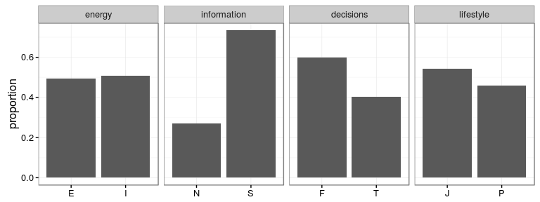
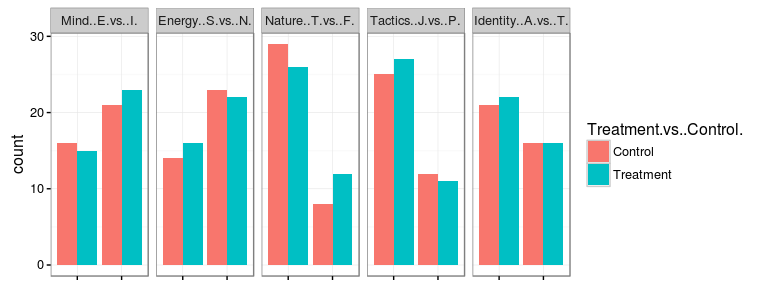
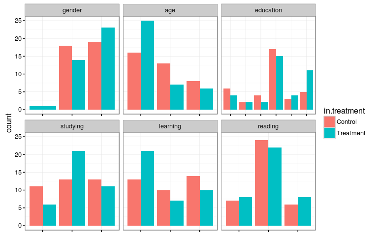
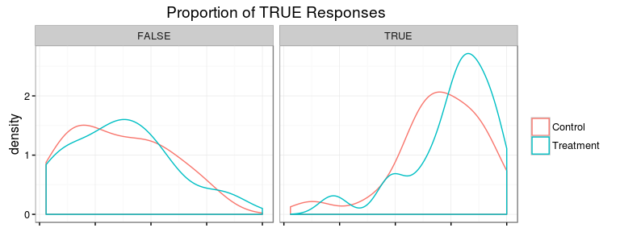

Introduction
============

Team members for the experimental study are Minhchau Dang, Sue Yang, and Chuck Bolin. The project could not have been completed in its current state without the help of research assistants Carter Lin and Grace Bolin.

Motivation
----------

Students at all levels ranging from high school to advanced PhD studies are required to read a variety of documents ranging from literature, news articles, published papers, and academic texts. These requirements are stipulated throughout a course of study in the form of assignments.

Reading assignments issued by the teacher will include the name of the document along with a number of pages to read. In many cases the student is tasked with completing the reading with very little guidance, if any.

Imagine one is assigned to read a 30 page technical document describing Google File System followed by the instruction, "Be prepared to discuss in class."

This assignment presents a quandary to the student. What should the student take away from the reading? Is a high-level understanding of the file system sufficient, or does the teacher care about the functional level of connecting several computers? Should the student memorize countless details or gloss over them? The expectation is finally clarified when the class meets to actually discuss the reading. If the students failed to read the teacher's mind then this may feed a negative view of the student, or the student may feel that the preparation time was wasted.

Details are important! Or perhaps they are not? It depends upon the people involved in the agreement to read and discuss the text.

Personality
-----------

Personality means the combination of characteristics or qualities that form an individual's distinctive character. It is believed to be formulated by the time a child enters first grade \[1\]. A long established method of describing personality is through the use of the Myers-Briggs Type Indicator (MBTI) instrument \[2\]. The test instrument uses 93 forced-choice questions to express a personality into four MBTI dichotomies \[3\].

Upon completing the test, each individual is given a report describing their personality type \[4\]. A personality type is expressed as a four character combination \[5\], such as ENFP, INFP, and INTP, with each character indicating your preference in each of the four MBTI dichotomies.

The focus of this research paper is on the Sensing-Intuition dichotomy. This dichotomy indicates whether a person is high or low detailed when approaching information \[6\], and the two sides are described as follows:

-   **Sensing (high-detail)**: "I notice facts and I remember details that are important to me."
-   **Intuition (low-detail)**: "I remember events more as an impression of what it was like than as actual facts or details of what happened."

When aggregating by dichotomy, 26.9% of the population are Intuition (low-detail), while Sensing (high-detail) commands a largely disproportionate value of 73.1%. This is significant when comparing the proportions of the other three attributes which tend to have a more balanced ratio.

When we aggregate by dichotomy, we find that 26.9% of the population are Intuition (low-detail) with Sensing (high-detail) commanding a largely disproportionate value of 73.1%. This is significant when comparing the proportions of the other three attributes which tend to comprise a more balanced ratio.

Research Questions
------------------

Do unguided reading assignments risk discriminating against 26.9% of the population--the Intuition (low-detail) people?

In order to answer this larger question, the team breaks it down into three primary sub-questions.

1.  Are the Sensing (high-detail) and Intuitive (low-detail) populations different from each other in a reading recall task?
2.  Is there a treatment effect through the use of guidance for the reading?
3.  Is this effect different between Sensing (high-detail) and Intuitive (low-detail) personalities?

You cannot change someone from being a Sensing (high-detail) personality type into being an Intuitive (low-detail) personality type through an experiment. If you simply attempt to observe the differences, there are countless confounding variables that could explain any apparent differences between the two populations studied. This makes the first question a fundamentally unanswerable question for experimental research.

In operationalizing the remaining two sub-questions, the team designed an experiment that will explicitly look at the following two questions:

1.  Does a study guide accompanying the reading assignment improve reading recall for both personality types?
2.  Is the improvement in recall from the study guide different between the two personality types?

The primary goal of this operationalization will be to answer the second question. More explicitly, is there a heterogeneous treatment effect from a study guide accompanying the reading assignment?

Hypothesis
----------

The team hypothesizes that under experimental conditions evaluating memory recall of information from a reading assignment, Sensing (high-detail) subjects would score higher than Intuition (low-detail) subjects in the control group (without guidance).

When provided with guidance (the treatment), it is hypothesized that both groups will score higher than their counterparts in the control group. Furthermore, it is proposed that Intuition (low-detail) personality will improve more than Sensing (high-detail) personality, thus reducing the gap between the two personality types.

Experimental Design
===================

Definition of Treatment
-----------------------

The key difficulty for a person tasked with a reading assignment is the uncertainty of knowing the parts of the reading upon which to focus. Therefore the treatment is presented in the form of a primer.

In the primer provided to the control group, the participants would be given the following paragraph *without guidance*.

> You will be given 6 minutes to read an article. Be prepared to answer some questions.
>
> ***Thank you for your participation in this experiment. Please do not share details of the experiment with others as it may compromise the usefulness of the final results.***

In the primer provided to the treatment group, the participants would be given the following paragraph *with guidance*.

> You will be given 6 minutes to read an article. Be prepared to answer some questions.
>
> ***You do NOT need to know facts related to dates (years, months, or days) referenced in the article. You do NOT need to know the names of any entertainers.***

These sentences are written in order to minimize any potential effect due to awareness of being in a treatment or control group in a group session setting, in the event that a participant glances at another participant's primer.

Experimental Sequence
---------------------

The following sequence of events describes the experiment. All forms and documents used in this sequence of events are available as supplementary material accompanying this report. It is applicable to administration to individuals or to groups of subjects.

1.  Subjects arrive and are welcomed. Subjects are reminded not to discuss details of the experiment for four weeks.
2.  Subjects read the "Consent to Participate in Research" form, ask any relevant questions, and sign the document.
3.  Subjects complete the online "Personality Test". The subjects are assigned a unique ID number and their personality types (e.g. INTJ-A) are recorded.
4.  The researcher references a pre-generated block randomization based upon the Sensing (high-detail) or Intuition (low-detail) personality type results and assigns each subject to a control or treatment group.
5.  Subjects are provided either a control or treatment primer (based on their group assignment) and are directed to read it. Subjects are provided an “Article” and given six minutes to read it.
6.  Subjects are given a "Covariate Questionnaire". In addition to providing basic information the questionnaire serves as a purposeful disruption in the cognitive process of memory recall before being queried on the reading assignment.
7.  Subjects are given a 40 question "Reading Recall Questionnaire", informed of the scoring rules (gain 1 point for a correct response, lose 1 point for an incorrect response, and 0 points if they chose not to answer), and allotted six minutes to complete the task.
8.  Subjects are thanked and reminded not to discuss details of the experiment for four weeks. If conducted on paper, the researcher enters the results of the personality tests and both questionnaires into an online form connected to Google Sheets.

The procedure for the steps described above are diagrammed below.

Reading Considerations
----------------------

The first task is to identify an appropriate reading for the experimental subjects. When evaluating potential reading materials, the following factors are deemed relevant:

-   **Reading Level**: Materials are to be chosen at reading level that contains a significant number of details without being too esoteric. Using the Flesch-Kincaid Reading Ease algorithm \[7\], an article that scored grade 12.8 was selected.
-   **Neutral content**: The material does not include information that may alienate the subject. Therefore, topics such as religion and politics were excluded. To quote one subject’s concern about the reading assignment prior to the experiment, "It's not about witchcraft or the devil, is it?"
-   **Length**: The length of the reading is an important factor. If it is too long, the subject may grow weary. If it is too short, the subjects’ personality resistance to the number of details may be insufficiently exercised. A word count of approximately 700 words in a six-minute period is sufficient when considering the average reading speed for adults. \[8\].

An excerpt from an article from an encyclopedia entry on the National Broadcasting Company, Inc. \[9\] was chosen for the experiment. This article is available in the supplementary material accompanying this report.

Other Considerations
--------------------

The team agreed upon the description of the experiment as a "Personality vs. Reading" study. This language was to be used in email, telephone, and in-person requests for volunteers. Disclosure of details such as specifying high and low detail personality types was avoided, including the word "recall" in order to not cue participants to memorize details.

When examining the parameters of experimentation, whether it should be conducted online or in-person only, the researchers were cognizant that an online participant's study style might compel them to refer back to a locally saved copy of the text if taken on-line. This aspect could affect proper randomization, such as an uneven distribution of these individuals between treatment and control or between Sensing (high-detail) and Intuition (low-detail) personalities. Therefore, it was decided to conduct the experiment in-person only.

When conducting in-person experiments, the team determined whether subjects should be tested one at a time in order to ensure consistency across subjects, or if the team should allow for larger groups for efficiency. A single subject could be tested at a cost of approximately 35 minutes, or a large group of subjects could be tested at a cost of about one hour. The team opted to allow for group testing, and to treat a single subject as an extra small group.

The method of assessment was another concern. The team discussed multiple choice and true/false type of questions. It was agreed that a true/false questionnaire would accommodate single and group testing scenarios, and it would greatly simplify analysis as it would exclude variation as to which wrong answer was preferred.

During the experiment, questions from the subject were taken prior to signing the "Consent to Participate in Research". After this point, we limited our speech to administrative directions. This would allow us to minimize any potential differences between researchers with respect to their interactions with the subjects.

Design Description
------------------

The experiment is described with the following table using the notation suggested by the Web Center for Social Research Methods \[10\]:

<table>
<colgroup>
<col width="18%" />
<col width="16%" />
<col width="20%" />
<col width="16%" />
<col width="8%" />
<col width="18%" />
</colgroup>
<thead>
<tr class="header">
<th align="left">Region</th>
<th align="left">Personality Test</th>
<th align="left">Sensing vs Intuitive</th>
<th align="left">Assignment</th>
<th align="left">Treated</th>
<th align="left">Collect Test Score</th>
</tr>
</thead>
<tbody>
<tr class="odd">
<td align="left">N (South Carolina)</td>
<td align="left">O</td>
<td align="left">N (Sensing)</td>
<td align="left">R (Block S1-T)</td>
<td align="left">X</td>
<td align="left">O</td>
</tr>
<tr class="even">
<td align="left"></td>
<td align="left">O</td>
<td align="left"></td>
<td align="left">R (Block S1-C)</td>
<td align="left"></td>
<td align="left">O</td>
</tr>
<tr class="odd">
<td align="left"></td>
<td align="left">O</td>
<td align="left">N (Intuitive)</td>
<td align="left">R (Block N1-T)</td>
<td align="left">X</td>
<td align="left">O</td>
</tr>
<tr class="even">
<td align="left"></td>
<td align="left">O</td>
<td align="left"></td>
<td align="left">R (Block N1-C)</td>
<td align="left"></td>
<td align="left">O</td>
</tr>
<tr class="odd">
<td align="left">N (California)</td>
<td align="left">O</td>
<td align="left">N (Sensing)</td>
<td align="left">R (Block S2-T)</td>
<td align="left">X</td>
<td align="left">O</td>
</tr>
<tr class="even">
<td align="left"></td>
<td align="left">O</td>
<td align="left"></td>
<td align="left">R (Block S2-C)</td>
<td align="left"></td>
<td align="left">O</td>
</tr>
<tr class="odd">
<td align="left"></td>
<td align="left">O</td>
<td align="left">N (Intuitive)</td>
<td align="left">R (Block N2-T)</td>
<td align="left">X</td>
<td align="left">O</td>
</tr>
<tr class="even">
<td align="left"></td>
<td align="left">O</td>
<td align="left"></td>
<td align="left">R (Block N2-C)</td>
<td align="left"></td>
<td align="left">O</td>
</tr>
<tr class="odd">
<td align="left">N (Delaware)</td>
<td align="left">O</td>
<td align="left">N (Sensing)</td>
<td align="left">R (Block S3-T)</td>
<td align="left">X</td>
<td align="left">O</td>
</tr>
<tr class="even">
<td align="left"></td>
<td align="left">O</td>
<td align="left"></td>
<td align="left">R (Block S3-C)</td>
<td align="left"></td>
<td align="left">O</td>
</tr>
<tr class="odd">
<td align="left"></td>
<td align="left">O</td>
<td align="left">N (Intuitive)</td>
<td align="left">R (Block N3-T)</td>
<td align="left">X</td>
<td align="left">O</td>
</tr>
<tr class="even">
<td align="left"></td>
<td align="left">O</td>
<td align="left"></td>
<td align="left">R (Block N3-C)</td>
<td align="left"></td>
<td align="left">O</td>
</tr>
</tbody>
</table>

The nonrandom and random groups are identified as follows:

-   The location of the subject (South Carolina, California, Delaware) is not a random variable manipulated by the researchers.
-   The personality test result is not a random variable manipulated by the researchers.
-   The subject is assigned to either control or treatment using pre-generated randomized lists (block randomization) that were created for each personality type at each location. This is a random variable manipulated by the researchers.

This notation makes explicit the fact that our team's experimental design is effectively six smaller experiments.

Analysis Precheck
=================

Statistical Power
-----------------

Prior to commencing the analysis of the experiment, the researchers want to know whether or not there is a chance of detecting an effect. To do that, the average score and the standard deviation of that score must be identified for the control population.

In assuming that the control and treatment have similar variance, then if the team wanted 80% power in detecting a score difference between the control and treatment groups using \(\alpha = 0.05\), the groups would need to be properly sized. The following table describes the result of using the `pwr.t.test` function to compute the needed sample size to detect the given true difference:

    ##   true.difference needed.size current.power
    ## 1             0.5        2241    0.08020943
    ## 2               1         561     0.1747189
    ## 3             1.5         250     0.3331124
    ## 4               2         141     0.5308397
    ## 5             2.5          91     0.7212663
    ## 6               3          64     0.8634363
    ## 7             3.5          47     0.9457718
    ## 8               4          36     0.9827614

An area of concern is the heterogeneous treatment effect, where the effective sample size is actually the number of people in treatment. The treatment group comprises half the number of people, and in this case, the heterogeneous effect is likely to be smaller than the base treatment effect. This yields the following table:

    ##    true.difference needed.size current.power
    ## 1              0.2       28002    0.05231686
    ## 2              0.4        7002    0.05930536
    ## 3              0.6        3113    0.07107133
    ## 4              0.8        1752    0.08776545
    ## 5                1        1122     0.1095477
    ## 6              1.2         780      0.136543
    ## 7              1.4         574     0.1687932
    ## 8              1.6         440     0.2062117
    ## 9              1.8         348     0.2485451
    ## 10               2         282     0.2953489

Verify Randomization
--------------------

During the next step, placebo tests were performed to confirm that the assignment to treatment and control groups is random. In these tests, it must be verified that being in treatment is not highly correlated with any variables, thus providing a confidence level that there is internal validity in the randomization.

In the first placebo test, a comparison is made regarding the personality dichotomy balance between the treatment and control groups. The plots below indicate that there the personality dichotomies are well balanced between the two groups (being in treatment or control does not predict any value for these variables), giving us confidence that our randomization has worked.

Verify Need for Clustered Design
--------------------------------

Four researchers conducted the experiment in three locations around the United States. Consequently there existed the possibility of between group variation, thus making it harder to estimate the average treatment effect precisely.

Additionally, one concern was there would be an effect from the slight variations between the way the experiment might be administered by each experimenter in each region. For example, in South Carolina and Delaware, the questionnaires were administered on paper, while in California the questionnaire was administered electronically.

In the experimental design description, the randomization planned for three different clusters based on the states. Because of the small sample size, the team wanted to know if the groups were actually different from each other, and thus whether the researchers benefited from this additional layer of complexity or if it would make more sense to simply pool the results.

### Variation Between Regions

A Levene's test was conducted to confirm homoskedasticity of the variances within each of the populations, and the result is not significant. Thus, the team is unable to reject the null hypothesis that the errors are homoskedastic. When the ANOVA test was run to compare the group means by region, the team also sees that it is unable to reject the null hypothesis that the group means are different.

The following table gives the results of these test runs:

    ## Levene's Test for Homogeneity of Variance (center = median)
    ##       Df F value Pr(>F)
    ## group  2  1.4905 0.2321
    ##       72

    ## Analysis of Variance Table
    ## 
    ## Response: Adjusted.Score
    ##           Df Sum Sq Mean Sq F value Pr(>F)
    ## Region     2  104.9  52.456  0.9689 0.3844
    ## Residuals 72 3898.2  54.142

Therefore at a regional level, there is no benefit gained from these distinct clusters because there is little difference between the clusters.

### Variation Between Experimenters

Before merging the data set, there may be a variation between the four different people administering the questionnaires. In South Carolina, there were two different people administering the experiment.

A Levene's test was conducted to confirm homoskedasticity of the variances within each of the populations, and the result is not significant. Thus, the team is unable to reject the null hypothesis that the errors are homoskedastic. When the ANOVA test was run to compare the group means by experimenter, the team also sees that it is unable to reject the null hypothesis that the group means are different.

The following table gives the results of these test runs:

    ## Levene's Test for Homogeneity of Variance (center = median)
    ##       Df F value Pr(>F)
    ## group  3  1.0446 0.3782
    ##       71

    ## Analysis of Variance Table
    ## 
    ## Response: Adjusted.Score
    ##              Df Sum Sq Mean Sq F value Pr(>F)
    ## Experimenter  3  107.4  35.794  0.6524 0.5841
    ## Residuals    71 3895.8  54.870

Therefore at an experimenter level, the team does not gain any benefit from these distinct clusters because the findings reveal little difference between clusters.

Pooled Results Design
---------------------

Because testing by region and testing by experimenter indicates that there is little variation between the groups we created, the team opts to pool the data from the different regions and experimenters, yielding the following experimental design:

| Personality Test | Sensing vs Intuitive | Assignment    | Treated | Collect Test Score |
|------------------|----------------------|---------------|---------|--------------------|
| O                | N (Sensing)          | R (Block S-T) | X       | O                  |
| O                |                      | R (Block S-C) |         | O                  |
| O                | N (Intuitive)        | R (Block N-T) | X       | O                  |
| O                |                      | R (Block N-C) |         | O                  |

This notation makes explicit the fact that our team's experimental design is now effectively two experiments.

Covariate Check
===============

The next step is to look at the covariates that were collected in the "Covariate Questionnaire". As they were unrelated to treatment, the team expects that there will be no correlation with treatment variables. However, the team expects that these covariates will explain some of the variance in the outcome.

Treatment Variable
------------------

First, the team examined the covariate balance between treatment and control.

The visualization points out that being younger may cause some preference in ending up in the treatment group. Given that we tested many variables, it is expected that at least one would to turn up significant. Other than that, the differences between groups appear random, so the team is willing to believe that our randomization worked and there is internal validity in the experimental design.

Outcome Variable
----------------

Next, the team examined how well these features predict the outcome.

    ##         name   F value      Pr(>F)
    ## 1:    gender 0.9048655   0.4091471
    ## 2:       age  1.655036   0.1982713
    ## 3: education  3.532256 0.006681307
    ## 4:  studying 0.1131372   0.8931866
    ## 5:  learning  1.463431   0.2382419
    ## 6:   reading 0.2813032   0.7556251

Among the ANOVA test results, `score ~ education` has significant result. (F value is 3.532, and p-value is very low too.)

This ANOVA result suggests that the variation of scores between different education levels is much larger than the variation of score within each education level. Our p-value is less than 0.05, indicating that the confidence interval does not include zero. Hence it is reasonable to reject the null hypothesis and assume that there is a relationship between score and education level.

Results Summary
===============

Statistical Power
-----------------

Using the formula for power in the Green and Gerber "Field Experiments" book \[11\], the team computed the expected statistical power for the experiment based on the sample.

    ## [1] 0.1330942

Statistical power with 75 subjects was calculated to be 0.133. In other words, the team only has a 13.3% chance of finding a statistically significant treatment effect when such an effect really exists.

Additionally, running the Shapiro-Wilk test on the outcomes indicates that the data is unlikely to be normally distributed, indicating that the power computations may need to be more complicated.

    ## 
    ##  Shapiro-Wilk normality test
    ## 
    ## data:  df.complete$adjusted.score
    ## W = 0.95932, p-value = 0.01674

Observations for Control Group
------------------------------

First the team examined the fundamentally unanswerable question:

> Are the Sensing (high-detail) and Intuitive (low-detail) populations different from each other in a reading recall task?

Even though the team cannot answer this question with this experiment, identifying whether the specific populations studied in this experiment differ will provide insight as to whether a heterogeneous treatment effect would be explained as making the scores more different or as making the scores more similar.

The alternate hypothesis predicts that there would be a statistically significant difference between Sensing (high-detail) and Intuition (low-detail) subject scores within the control group.

The corresponding null hypothesis is that there is no statistically significant difference between Sensing (high-detail) and Intuition (low-detail) subject scores within the control group.

    ## 
    ##  Welch Two Sample t-test
    ## 
    ## data:  adjusted.score by energy
    ## t = 1.6639, df = 34.34, p-value = 0.1052
    ## alternative hypothesis: true difference in means is not equal to 0
    ## 95 percent confidence interval:
    ##  -0.9571528  9.6217490
    ## sample estimates:
    ## mean in group Intuition   mean in group Sensing 
    ##                15.07143                10.73913

The t-test indicates that the Intuition (low-detail) subjects in the control group scored higher than Sensing (high-detail) subjects in the control group by 4.3 points, and this has a p-value of 0.105. The team cannot draw any causal interpretation from this result (and it is the opposite of the team's hypothesis), but it can be used to establish a baseline for understanding the heterogeneous treatment effect, should one exist.

The direction of the difference indicates that if the heterogeneous treatment effect is positive for Sensing (high-detail) personality types, the treatment makes the populations more similar, while if the heterogeneous treatment effect is negative for Sensing (high-detail) personality types, the treatment makes the populations more different.

Results for Treatment Group
---------------------------

The first sub-question for this experiment was as follows:

> Does a study guide accompanying the reading assignment improve reading recall for both personality types?

The alternate hypothesis predicts that there would be a statistically significant difference between control group and the treatment group for both the Sensing (high-detail) subjects and the Intuition (low-detail) subjects.

The corresponding null hypothesis is that there is no statistically significant difference between the treatment and the control group for both the Sensing (high-detail) subjects and the Intuition (low-detail) subjects.

Examining the mean scores suggests that the treatment results in a decrease in the mean score for Intuition (low-detail) subjects and an increase in the mean score for the (high-detail) subjects, though there is high variance in the sample.

    ##       energy in.treatment     mean       sd
    ## 1: Intuition      Control 15.07143 6.450573
    ## 2: Intuition    Treatment 13.43750 5.715112
    ## 3:   Sensing      Control 10.73913 9.357629
    ## 4:   Sensing    Treatment 14.50000 6.246904

### Treatment Independent of Personality Types

The first t-test checks the null hypothesis concerning the two groups in the aggregate, which assumes that there is no difference between the control group and the treatment group.

    ## 
    ##  Welch Two Sample t-test
    ## 
    ## data:  adjusted.score by in.treatment
    ## t = -0.98083, df = 64.236, p-value = 0.3304
    ## alternative hypothesis: true difference in means is not equal to 0
    ## 95 percent confidence interval:
    ##  -5.084085  1.735578
    ## sample estimates:
    ##   mean in group Control mean in group Treatment 
    ##                12.37838                14.05263

The t-test indicates that the subjects in the treatment group scored *higher* than the subjects in the control group by 1.7 points, and this has a p-value of 0.330.

### Treatment on Sensing Personality Types

The next t-test checks the null hypothesis concerning Sensing (high-detail) subjects, which assumes there is no difference between the Sensing (high-detail) personality types in the control group and the Sensing (high-detail) personality types in the treatment group.

    ## 
    ##  Welch Two Sample t-test
    ## 
    ## data:  adjusted.score by in.treatment
    ## t = -1.592, df = 38.517, p-value = 0.1196
    ## alternative hypothesis: true difference in means is not equal to 0
    ## 95 percent confidence interval:
    ##  -8.541218  1.019479
    ## sample estimates:
    ##   mean in group Control mean in group Treatment 
    ##                10.73913                14.50000

The t-test indicates that the Sensing (high-detail) subjects in the treatment group scored *higher* than Sensing (high-detail) subjects in the control group by 3.8 points, and this has a p-value of 0.120.

### Treatment on Intuitive Personality Types

The next t-test checks the null hypothesis concerning Intuitive (low-detail) subjects, which assumes there is no difference between the Intuitive (low-detail) personality types in the control group and the Intuitive (low-detail) personality types in the treatment group.

    ## 
    ##  Welch Two Sample t-test
    ## 
    ## data:  adjusted.score by in.treatment
    ## t = 0.72973, df = 26.256, p-value = 0.472
    ## alternative hypothesis: true difference in means is not equal to 0
    ## 95 percent confidence interval:
    ##  -2.966412  6.234269
    ## sample estimates:
    ##   mean in group Control mean in group Treatment 
    ##                15.07143                13.43750

The t-test indicates that the Intuitive (low-detail) subjects in the treatment group scored *lower* than Intuitive (low-detail) subjects in the control group by 1.6 points, and this has a p-value of 0.472.

Results for Heterogeneous Treatment Effect
------------------------------------------

The second sub-question for this experiment was as follows:

> Is the improvement in recall from the study guide different between the two personality types?

Given the opposing directions of the treatment effect on the Sensing (high-detail) personality types and the Intuitive (low-detail) personality types, this gives the research team confidence that there is a heterogeneous treatment effect. The following sections formally test for this effect.

### Baseline Model

This heterogeneous treatment effect can be tested using linear regression. The following baseline model predicts the adjusted score:

\[
\begin{split}
AdjustedScore_i = & \beta_0 +
  \beta_1 Sensing_i +
  \beta_2 InTreatment_i +
  \beta_3 InTreatment_i \times Sensing_i
\end{split}
\]

For a subject \(i\), \(AdjustedScore_i\) corresponds to the subject's adjusted score from the questionnaire, \(Sensing_i\) corresponds to whether the person has a Sensing (high-detail) personality type, and \(InTreatment_i\) corresponds to whether the subject was provided with the treatment primer.

For reference purposes, the model will be evaluated against a model leveraging only \(InTreatment_i\) and against a model leveraging both \(Sensing_i\) and \(InTreatment_i\) using `stargazer` \[12\]:

<table style="text-align:center">
<caption>
<strong>Energy and Treatment</strong>
</caption>
<tr>
<td colspan="4" style="border-bottom: 1px solid black">
</td>
</tr>
<tr>
<td style="text-align:left">
</td>
<td colspan="3">
<em>Dependent variable:</em>
</td>
</tr>
<tr>
<td>
</td>
<td colspan="3" style="border-bottom: 1px solid black">
</td>
</tr>
<tr>
<td style="text-align:left">
</td>
<td colspan="3">
Adjusted Score
</td>
</tr>
<tr>
<td style="text-align:left">
</td>
<td>
(1)
</td>
<td>
(2)
</td>
<td>
(3)
</td>
</tr>
<tr>
<td colspan="4" style="border-bottom: 1px solid black">
</td>
</tr>
<tr>
<td style="text-align:left">
Sensing
</td>
<td>
</td>
<td>
-1.551
</td>
<td>
-4.332\*
</td>
</tr>
<tr>
<td style="text-align:left">
</td>
<td>
</td>
<td>
(1.738)
</td>
<td>
(2.472)
</td>
</tr>
<tr>
<td style="text-align:left">
</td>
<td>
</td>
<td>
</td>
<td>
</td>
</tr>
<tr>
<td style="text-align:left">
Treatment Primer
</td>
<td>
1.674
</td>
<td>
1.608
</td>
<td>
-1.634
</td>
</tr>
<tr>
<td style="text-align:left">
</td>
<td>
(1.699)
</td>
<td>
(1.703)
</td>
<td>
(2.669)
</td>
</tr>
<tr>
<td style="text-align:left">
</td>
<td>
</td>
<td>
</td>
<td>
</td>
</tr>
<tr>
<td style="text-align:left">
Sensing x Treatment Primer
</td>
<td>
</td>
<td>
</td>
<td>
5.395
</td>
</tr>
<tr>
<td style="text-align:left">
</td>
<td>
</td>
<td>
</td>
<td>
(3.443)
</td>
</tr>
<tr>
<td style="text-align:left">
</td>
<td>
</td>
<td>
</td>
<td>
</td>
</tr>
<tr>
<td style="text-align:left">
Constant
</td>
<td>
12.378\*\*\*
</td>
<td>
13.342\*\*\*
</td>
<td>
15.071\*\*\*
</td>
</tr>
<tr>
<td style="text-align:left">
</td>
<td>
(1.209)
</td>
<td>
(1.623)
</td>
<td>
(1.949)
</td>
</tr>
<tr>
<td style="text-align:left">
</td>
<td>
</td>
<td>
</td>
<td>
</td>
</tr>
<tr>
<td colspan="4" style="border-bottom: 1px solid black">
</td>
</tr>
<tr>
<td style="text-align:left">
Observations
</td>
<td>
75
</td>
<td>
75
</td>
<td>
75
</td>
</tr>
<tr>
<td style="text-align:left">
R2
</td>
<td>
0.013
</td>
<td>
0.024
</td>
<td>
0.057
</td>
</tr>
<tr>
<td style="text-align:left">
Adjusted R2
</td>
<td>
-0.0004
</td>
<td>
-0.003
</td>
<td>
0.017
</td>
</tr>
<tr>
<td style="text-align:left">
Residual Std. Error
</td>
<td>
7.356 (df = 73)
</td>
<td>
7.367 (df = 72)
</td>
<td>
7.293 (df = 71)
</td>
</tr>
<tr>
<td style="text-align:left">
F Statistic
</td>
<td>
0.971 (df = 1; 73)
</td>
<td>
0.882 (df = 2; 72)
</td>
<td>
1.418 (df = 3; 71)
</td>
</tr>
<tr>
<td colspan="4" style="border-bottom: 1px solid black">
</td>
</tr>
<tr>
<td style="text-align:left">
<em>Note:</em>
</td>
<td colspan="3" style="text-align:right">
*p&lt;0.1; **p&lt;0.05; ***p&lt;0.01
</td>
</tr>
</table>
In this model, the average treatment effect for Intuitive (low-detail) personality types is estimated to be \(\hat{\beta}_2 = -1.634\) and the average treatment effect for Sensing (high-detail) personality types is estimated to be \(\hat{\beta}_2 + \hat{\beta}_3 = -1.634 + 5.395 = 3.761\).

### Region-Sensitive Model

As noted in the analysis pre-check, four researchers conducted the experiment in three locations around the United States. Consequently there existed the possibility of between group variation, thus making it harder to estimate the average treatment effect precisely.

While the between-group variations by region did not appear to be statistically significant, the team believes it is reasonable to continue accounting for this variation in the model, particularly since the original experimental design attempted to account for this variation.

The following model predicts the adjusted score while also accounting for between-region variation:

\[
\begin{split}
AdjustedScore_i = & \beta_0 +
  \beta_1 Sensing_i +
  \beta_2 InTreatment_i +
  \beta_3 InTreatment_i \times Sensing_i + \\ &
  \beta_4 Delaware_i +
  \beta_5 SouthCarolina_i
\end{split}
\]

For a subject \(i\), \(Delaware_i\) indicates whether the subject participated in Delaware and \(SouthCarolina_i\) indicates whether the subject participated in South Carolina. Having a zero for both indicator variables indicates that the subject participated in California.

This model with clustered standard errors is compared to the baseline model with the \(Sensing_i\) and \(InTreatment_i\) interaction term using `stargazer` \[12\]:

<table style="text-align:center">
<caption>
<strong>Region, Energy, and Treatment</strong>
</caption>
<tr>
<td colspan="3" style="border-bottom: 1px solid black">
</td>
</tr>
<tr>
<td style="text-align:left">
</td>
<td colspan="2">
<em>Dependent variable:</em>
</td>
</tr>
<tr>
<td>
</td>
<td colspan="2" style="border-bottom: 1px solid black">
</td>
</tr>
<tr>
<td style="text-align:left">
</td>
<td colspan="2">
Adjusted Score
</td>
</tr>
<tr>
<td style="text-align:left">
</td>
<td>
(1)
</td>
<td>
(2)
</td>
</tr>
<tr>
<td colspan="3" style="border-bottom: 1px solid black">
</td>
</tr>
<tr>
<td style="text-align:left">
Sensing
</td>
<td>
-4.332\*
</td>
<td>
-3.903\*
</td>
</tr>
<tr>
<td style="text-align:left">
</td>
<td>
(2.472)
</td>
<td>
(2.135)
</td>
</tr>
<tr>
<td style="text-align:left">
</td>
<td>
</td>
<td>
</td>
</tr>
<tr>
<td style="text-align:left">
Treatment Primer
</td>
<td>
-1.634
</td>
<td>
-1.572
</td>
</tr>
<tr>
<td style="text-align:left">
</td>
<td>
(2.669)
</td>
<td>
(2.699)
</td>
</tr>
<tr>
<td style="text-align:left">
</td>
<td>
</td>
<td>
</td>
</tr>
<tr>
<td style="text-align:left">
Participant in Delaware
</td>
<td>
</td>
<td>
-1.307\*\*\*
</td>
</tr>
<tr>
<td style="text-align:left">
</td>
<td>
</td>
<td>
(0.158)
</td>
</tr>
<tr>
<td style="text-align:left">
</td>
<td>
</td>
<td>
</td>
</tr>
<tr>
<td style="text-align:left">
Participant in South Carolina
</td>
<td>
</td>
<td>
-2.171\*\*\*
</td>
</tr>
<tr>
<td style="text-align:left">
</td>
<td>
</td>
<td>
(0.330)
</td>
</tr>
<tr>
<td style="text-align:left">
</td>
<td>
</td>
<td>
</td>
</tr>
<tr>
<td style="text-align:left">
Sensing x Treatment Primer
</td>
<td>
5.395
</td>
<td>
5.123\*\*
</td>
</tr>
<tr>
<td style="text-align:left">
</td>
<td>
(3.443)
</td>
<td>
(2.220)
</td>
</tr>
<tr>
<td style="text-align:left">
</td>
<td>
</td>
<td>
</td>
</tr>
<tr>
<td style="text-align:left">
Constant
</td>
<td>
15.071\*\*\*
</td>
<td>
16.097\*\*\*
</td>
</tr>
<tr>
<td style="text-align:left">
</td>
<td>
(1.949)
</td>
<td>
(1.688)
</td>
</tr>
<tr>
<td style="text-align:left">
</td>
<td>
</td>
<td>
</td>
</tr>
<tr>
<td colspan="3" style="border-bottom: 1px solid black">
</td>
</tr>
<tr>
<td style="text-align:left">
Observations
</td>
<td>
75
</td>
<td>
75
</td>
</tr>
<tr>
<td style="text-align:left">
R2
</td>
<td>
0.057
</td>
<td>
0.072
</td>
</tr>
<tr>
<td style="text-align:left">
Adjusted R2
</td>
<td>
0.017
</td>
<td>
0.004
</td>
</tr>
<tr>
<td style="text-align:left">
Residual Std. Error
</td>
<td>
7.293 (df = 71)
</td>
<td>
7.338 (df = 69)
</td>
</tr>
<tr>
<td style="text-align:left">
F Statistic
</td>
<td>
1.418 (df = 3; 71)
</td>
<td>
1.067 (df = 5; 69)
</td>
</tr>
<tr>
<td colspan="3" style="border-bottom: 1px solid black">
</td>
</tr>
<tr>
<td style="text-align:left">
<em>Note:</em>
</td>
<td colspan="2" style="text-align:right">
*p&lt;0.1; **p&lt;0.05; ***p&lt;0.01
</td>
</tr>
</table>
In this model, the average treatment effect for Intuitive (low-detail) personality types is estimated to be \(\hat{\beta}_2 = -1.572\) and the average treatment effect for Sensing (high-detail) personality types is estimated to be \(\hat{\beta}_2 + \hat{\beta}_3 = -1.572 + 5.123 = 3.551\).

Additionally, the estimated heterogeneous treatment effect is statistically significant with \(\alpha = 0.05\).

### Experimenter-Sensitive Model

The following model predicts the adjusted score while also accounting for between-experimenter variation:

\[
\begin{split}
AdjustedScore_i = & \beta_0 +
  \beta_1 Sensing_i +
  \beta_2 InTreatment_i +
  \beta_3 InTreatment_i \times Sensing_i + \\ &
  \beta_6 Chuck_i +
  \beta_7 Grace_i +
  \beta_8 Minhchau_i
\end{split}
\]

For a subject \(i\), \(Chuck_i\) indicates whether the subject participated in South Carolina with Chuck as the experimenter, \(Grace_i\) indicates whether the subject participated in South Carolina with Grace as the experimenter, and \(Minhchau_i\) indicates whether the subject participated in California with Minhchau as the experimenter. Having a zero for all indicator variables indicates that the subject participated in Delaware with Carter as the experimenter.

This model with clustered standard errors is compared to the baseline model with the \(Sensing_i\) and \(InTreatment_i\) interaction term using `stargazer` \[12\]:

<table style="text-align:center">
<caption>
<strong>Experimenter, Energy, and Treatment</strong>
</caption>
<tr>
<td colspan="3" style="border-bottom: 1px solid black">
</td>
</tr>
<tr>
<td style="text-align:left">
</td>
<td colspan="2">
<em>Dependent variable:</em>
</td>
</tr>
<tr>
<td>
</td>
<td colspan="2" style="border-bottom: 1px solid black">
</td>
</tr>
<tr>
<td style="text-align:left">
</td>
<td colspan="2">
Adjusted Score
</td>
</tr>
<tr>
<td style="text-align:left">
</td>
<td>
(1)
</td>
<td>
(2)
</td>
</tr>
<tr>
<td colspan="3" style="border-bottom: 1px solid black">
</td>
</tr>
<tr>
<td style="text-align:left">
Sensing
</td>
<td>
-4.332\*
</td>
<td>
-3.924
</td>
</tr>
<tr>
<td style="text-align:left">
</td>
<td>
(2.472)
</td>
<td>
(2.476)
</td>
</tr>
<tr>
<td style="text-align:left">
</td>
<td>
</td>
<td>
</td>
</tr>
<tr>
<td style="text-align:left">
Treatment Primer
</td>
<td>
-1.634
</td>
<td>
-1.591
</td>
</tr>
<tr>
<td style="text-align:left">
</td>
<td>
(2.669)
</td>
<td>
(2.601)
</td>
</tr>
<tr>
<td style="text-align:left">
</td>
<td>
</td>
<td>
</td>
</tr>
<tr>
<td style="text-align:left">
Administered by Chuck
</td>
<td>
</td>
<td>
-0.724
</td>
</tr>
<tr>
<td style="text-align:left">
</td>
<td>
</td>
<td>
(0.575)
</td>
</tr>
<tr>
<td style="text-align:left">
</td>
<td>
</td>
<td>
</td>
</tr>
<tr>
<td style="text-align:left">
Administered by Grace
</td>
<td>
</td>
<td>
-0.965\*
</td>
</tr>
<tr>
<td style="text-align:left">
</td>
<td>
</td>
<td>
(0.507)
</td>
</tr>
<tr>
<td style="text-align:left">
</td>
<td>
</td>
<td>
</td>
</tr>
<tr>
<td style="text-align:left">
Administered by Minhchau
</td>
<td>
</td>
<td>
1.308\*\*\*
</td>
</tr>
<tr>
<td style="text-align:left">
</td>
<td>
</td>
<td>
(0.184)
</td>
</tr>
<tr>
<td style="text-align:left">
</td>
<td>
</td>
<td>
</td>
</tr>
<tr>
<td style="text-align:left">
Sensing x Treatment Primer
</td>
<td>
5.395
</td>
<td>
5.177\*\*
</td>
</tr>
<tr>
<td style="text-align:left">
</td>
<td>
(3.443)
</td>
<td>
(2.133)
</td>
</tr>
<tr>
<td style="text-align:left">
</td>
<td>
</td>
<td>
</td>
</tr>
<tr>
<td style="text-align:left">
Constant
</td>
<td>
15.071\*\*\*
</td>
<td>
14.794\*\*\*
</td>
</tr>
<tr>
<td style="text-align:left">
</td>
<td>
(1.949)
</td>
<td>
(1.742)
</td>
</tr>
<tr>
<td style="text-align:left">
</td>
<td>
</td>
<td>
</td>
</tr>
<tr>
<td colspan="3" style="border-bottom: 1px solid black">
</td>
</tr>
<tr>
<td style="text-align:left">
Observations
</td>
<td>
75
</td>
<td>
75
</td>
</tr>
<tr>
<td style="text-align:left">
R2
</td>
<td>
0.057
</td>
<td>
0.072
</td>
</tr>
<tr>
<td style="text-align:left">
Adjusted R2
</td>
<td>
0.017
</td>
<td>
-0.010
</td>
</tr>
<tr>
<td style="text-align:left">
Residual Std. Error
</td>
<td>
7.293 (df = 71)
</td>
<td>
7.392 (df = 68)
</td>
</tr>
<tr>
<td style="text-align:left">
F Statistic
</td>
<td>
1.418 (df = 3; 71)
</td>
<td>
0.877 (df = 6; 68)
</td>
</tr>
<tr>
<td colspan="3" style="border-bottom: 1px solid black">
</td>
</tr>
<tr>
<td style="text-align:left">
<em>Note:</em>
</td>
<td colspan="2" style="text-align:right">
*p&lt;0.1; **p&lt;0.05; ***p&lt;0.01
</td>
</tr>
</table>
In this model, the average treatment effect for Intuitive (low-detail) personality types is estimated to be \(\hat{\beta}_2 = -1.591\) and the average treatment effect for Sensing (high-detail) personality types is estimated to be \(\hat{\beta}_2 + \hat{\beta}_3 = -1.591 + 5.177 = 3.586\). The estimated heterogeneous treatment effect is statistically significant with \(\alpha = 0.05\).

Additionally, the estimated heterogeneous treatment effect is statistically significant with \(\alpha = 0.05\).

Applications and Future Research
================================

Solidifying the Result
----------------------

Past research indicated a lack of statistically significant result when comparing Sensing (high-detail) personality types and Intuitive (low-detail) personality types in nursing \[13\], as well as an improvement for Intuitive (low-detail) personality types in engineering \[14\].

Still, the research team was surprised that the group means were the opposite of what was hypothesized given the specific task under evaluation. In particular, the team was surprised that providing additional instructions appeared to lower scores for Intuitive (low-detail) personality types.

    ##       energy in.treatment     mean       sd
    ## 1: Intuition      Control 15.07143 6.450573
    ## 2: Intuition    Treatment 13.43750 5.715112
    ## 3:   Sensing      Control 10.73913 9.357629
    ## 4:   Sensing    Treatment 14.50000 6.246904

Given the lack of statistical power, this may have been a case of regression to the mean. Additional follow up will be needed in order to evaluate the model.

Going on a Fishing Expedition
-----------------------------

### Education as a Predictor

In performing covariate checks, the team observed that there was a statistically significant correlation between the outcome variable and education.

For an individual \(i\), if we let \(education_{i1}\) indicate if the individual finished education after completing high school, \(education_{i2}\) indicate if the individual finished their education after receiving an associate's degree, \(education_{i3}\) indicate if the individual finished their education after 3+ years without receiving a degree, \(education_{i4}\) indicate if the individual received a bachelor's degree, and \(education_{i5}\) indicate if the individual finsihed their education after receiving a master's degree or higher.

The following model adds education as a variable:

\[
\begin{split}
AdjustedScore_i = & \beta_0 +
  \beta_1 Sensing_i +
  \beta_2 InTreatment_i +
  \beta_3 InTreatment_i \times Sensing_i + \\ &
  \beta_4 Delaware_i +
  \beta_5 SouthCarolina_i + \\ &
  \beta_9 Education_{1_i} + \beta_{10} Education_{2_i} + \beta_{11} Education_{3_i} + \beta_{12} Education_{4_i} + \beta_{13} Education_{5_i}
\end{split}
\]

For a subject \(i\), \(Education_{1_i}\) indicates whether the highest level of education attained is a high school diploma or GED, \(Education_{2_i}\) indicates whether the highest level of education attained is an associate's degree, \(Education_{3_i}\) indicates whether the highest level of education attained is 3 or more years of college without a degree, \(Education_{4_i}\) indicates whether the highest level of education attained is a bachelor's degree, and \(Education_{5_i}\) indicates whether the highest level of education attained is a master's degree or higher.

This model with clustered standard errors is compared to the region-specific model using `stargazer` \[12\]:

<table style="text-align:center">
<caption>
<strong>Fishing Expedition</strong>
</caption>
<tr>
<td colspan="4" style="border-bottom: 1px solid black">
</td>
</tr>
<tr>
<td style="text-align:left">
</td>
<td colspan="3">
<em>Dependent variable:</em>
</td>
</tr>
<tr>
<td>
</td>
<td colspan="3" style="border-bottom: 1px solid black">
</td>
</tr>
<tr>
<td style="text-align:left">
</td>
<td colspan="3">
Adjusted Score
</td>
</tr>
<tr>
<td style="text-align:left">
</td>
<td>
(1)
</td>
<td>
(2)
</td>
<td>
(3)
</td>
</tr>
<tr>
<td colspan="4" style="border-bottom: 1px solid black">
</td>
</tr>
<tr>
<td style="text-align:left">
energySensing
</td>
<td>
-3.903\*
</td>
<td>
</td>
<td>
-3.576\*\*
</td>
</tr>
<tr>
<td style="text-align:left">
</td>
<td>
(2.135)
</td>
<td>
</td>
<td>
(1.490)
</td>
</tr>
<tr>
<td style="text-align:left">
</td>
<td>
</td>
<td>
</td>
<td>
</td>
</tr>
<tr>
<td style="text-align:left">
in.treatmentTreatment
</td>
<td>
-1.572
</td>
<td>
</td>
<td>
-1.968
</td>
</tr>
<tr>
<td style="text-align:left">
</td>
<td>
(2.699)
</td>
<td>
</td>
<td>
(2.936)
</td>
</tr>
<tr>
<td style="text-align:left">
</td>
<td>
</td>
<td>
</td>
<td>
</td>
</tr>
<tr>
<td style="text-align:left">
regionDelaware
</td>
<td>
-1.307\*\*\*
</td>
<td>
</td>
<td>
-0.716
</td>
</tr>
<tr>
<td style="text-align:left">
</td>
<td>
(0.158)
</td>
<td>
</td>
<td>
(0.735)
</td>
</tr>
<tr>
<td style="text-align:left">
</td>
<td>
</td>
<td>
</td>
<td>
</td>
</tr>
<tr>
<td style="text-align:left">
regionSouth Carolina
</td>
<td>
-2.171\*\*\*
</td>
<td>
</td>
<td>
0.967
</td>
</tr>
<tr>
<td style="text-align:left">
</td>
<td>
(0.330)
</td>
<td>
</td>
<td>
(2.472)
</td>
</tr>
<tr>
<td style="text-align:left">
</td>
<td>
</td>
<td>
</td>
<td>
</td>
</tr>
<tr>
<td style="text-align:left">
energySensing:in.treatmentTreatment
</td>
<td>
5.123\*\*
</td>
<td>
</td>
<td>
5.986\*\*\*
</td>
</tr>
<tr>
<td style="text-align:left">
</td>
<td>
(2.220)
</td>
<td>
</td>
<td>
(1.992)
</td>
</tr>
<tr>
<td style="text-align:left">
</td>
<td>
</td>
<td>
</td>
<td>
</td>
</tr>
<tr>
<td style="text-align:left">
education1
</td>
<td>
</td>
<td>
-10.300\*\*\*
</td>
<td>
-11.260\*\*\*
</td>
</tr>
<tr>
<td style="text-align:left">
</td>
<td>
</td>
<td>
(3.349)
</td>
<td>
(1.684)
</td>
</tr>
<tr>
<td style="text-align:left">
</td>
<td>
</td>
<td>
</td>
<td>
</td>
</tr>
<tr>
<td style="text-align:left">
education2
</td>
<td>
</td>
<td>
-7.800\*\*
</td>
<td>
-7.076\*\*\*
</td>
</tr>
<tr>
<td style="text-align:left">
</td>
<td>
</td>
<td>
(3.510)
</td>
<td>
(1.782)
</td>
</tr>
<tr>
<td style="text-align:left">
</td>
<td>
</td>
<td>
</td>
<td>
</td>
</tr>
<tr>
<td style="text-align:left">
education3
</td>
<td>
</td>
<td>
0.200
</td>
<td>
-0.780
</td>
</tr>
<tr>
<td style="text-align:left">
</td>
<td>
</td>
<td>
(4.021)
</td>
<td>
(2.770)
</td>
</tr>
<tr>
<td style="text-align:left">
</td>
<td>
</td>
<td>
</td>
<td>
</td>
</tr>
<tr>
<td style="text-align:left">
education4
</td>
<td>
</td>
<td>
-0.894
</td>
<td>
-0.564
</td>
</tr>
<tr>
<td style="text-align:left">
</td>
<td>
</td>
<td>
(2.462)
</td>
<td>
(4.546)
</td>
</tr>
<tr>
<td style="text-align:left">
</td>
<td>
</td>
<td>
</td>
<td>
</td>
</tr>
<tr>
<td style="text-align:left">
education5
</td>
<td>
</td>
<td>
-0.550
</td>
<td>
-0.377
</td>
</tr>
<tr>
<td style="text-align:left">
</td>
<td>
</td>
<td>
(2.740)
</td>
<td>
(3.585)
</td>
</tr>
<tr>
<td style="text-align:left">
</td>
<td>
</td>
<td>
</td>
<td>
</td>
</tr>
<tr>
<td style="text-align:left">
Constant
</td>
<td>
16.097\*\*\*
</td>
<td>
15.300\*\*\*
</td>
<td>
16.407\*\*\*
</td>
</tr>
<tr>
<td style="text-align:left">
</td>
<td>
(1.688)
</td>
<td>
(2.149)
</td>
<td>
(3.588)
</td>
</tr>
<tr>
<td style="text-align:left">
</td>
<td>
</td>
<td>
</td>
<td>
</td>
</tr>
<tr>
<td colspan="4" style="border-bottom: 1px solid black">
</td>
</tr>
<tr>
<td style="text-align:left">
Observations
</td>
<td>
75
</td>
<td>
75
</td>
<td>
75
</td>
</tr>
<tr>
<td style="text-align:left">
R2
</td>
<td>
0.072
</td>
<td>
0.204
</td>
<td>
0.255
</td>
</tr>
<tr>
<td style="text-align:left">
Adjusted R2
</td>
<td>
0.004
</td>
<td>
0.146
</td>
<td>
0.138
</td>
</tr>
<tr>
<td style="text-align:left">
Residual Std. Error
</td>
<td>
7.338 (df = 69)
</td>
<td>
6.797 (df = 69)
</td>
<td>
6.828 (df = 64)
</td>
</tr>
<tr>
<td style="text-align:left">
F Statistic
</td>
<td>
1.067 (df = 5; 69)
</td>
<td>
3.532\*\*\* (df = 5; 69)
</td>
<td>
2.187\*\* (df = 10; 64)
</td>
</tr>
<tr>
<td colspan="4" style="border-bottom: 1px solid black">
</td>
</tr>
<tr>
<td style="text-align:left">
<em>Note:</em>
</td>
<td colspan="3" style="text-align:right">
*p&lt;0.1; **p&lt;0.05; ***p&lt;0.01
</td>
</tr>
</table>
The addition of the education indicator variables increases the variance for the \(InTreatment_i\) term and reduces the variance in the \(Sensing_i\) and \(InTreatment_i\) interaction term.

Note that the \(R^2\) is substantially higher for education alone than for the region-specific model.

### True vs. False Questions

In this experiment, questions where the correct answer was FALSE were intended to be trickier than questions where the correct answer was TRUE. However, questions which everyone gets wrong have no power to discriminate between individuals who do recall details from a reading and individuals who do not recall details from a reading.

During the pilot study, the research team identified several questions that were answered in the same way by all pilot study participants, suggesting that these questions were either too easy (in the case where all participants chose the correct answer) or too difficult (in the case where all participants chose the incorrect answer). These questions were replaced for the actual experiment.

After identifying questions that were both too easy and too difficult, the research team asked the following question: will all questions be equally affected by the treatment? In other words, in making the questions where the correct answer was FALSE trickier than the questions where the correct answer was TRUE, will the treatment primer have less of an effect on those questions?

At a coarse-grained level, this research question could be operationalized as follows: does the treatment have a different effect on true questions vs. false questions? A simple linear regression model which includes this different effect as a heterogeneous treatment effect has the following form:

\[
\begin{split}
Proportion_j = & \beta_0 +
  \beta_1 CorrectAnswer_j +
  \beta_2 InTreatment_j +
  \beta_3 InTreatment_j \times CorrectAnswer_j
\end{split}
\]

For a given question \(j\), \(Proportion_j\) indicates the proportion of TRUE responses received for the question, \(CorrectAnswer_j\) indicates whether the correct answer for the question is TRUE, and \(InTreatment_j\) indicates whether the statistic corresponds to the average of the control group or the treatment group for that question.

<table style="text-align:center">
<caption>
<strong>True vs. False Answers</strong>
</caption>
<tr>
<td colspan="2" style="border-bottom: 1px solid black">
</td>
</tr>
<tr>
<td style="text-align:left">
</td>
<td>
<em>Dependent variable:</em>
</td>
</tr>
<tr>
<td>
</td>
<td colspan="1" style="border-bottom: 1px solid black">
</td>
</tr>
<tr>
<td style="text-align:left">
</td>
<td>
Proportion of TRUE Responses
</td>
</tr>
<tr>
<td colspan="2" style="border-bottom: 1px solid black">
</td>
</tr>
<tr>
<td style="text-align:left">
Correct Answer is TRUE
</td>
<td>
0.343\*\*\*
</td>
</tr>
<tr>
<td style="text-align:left">
</td>
<td>
(0.066)
</td>
</tr>
<tr>
<td style="text-align:left">
</td>
<td>
</td>
</tr>
<tr>
<td style="text-align:left">
Treatment Primer
</td>
<td>
0.010
</td>
</tr>
<tr>
<td style="text-align:left">
</td>
<td>
(0.066)
</td>
</tr>
<tr>
<td style="text-align:left">
</td>
<td>
</td>
</tr>
<tr>
<td style="text-align:left">
Correct Answer is TRUE x Treatment Primer
</td>
<td>
0.049
</td>
</tr>
<tr>
<td style="text-align:left">
</td>
<td>
(0.094)
</td>
</tr>
<tr>
<td style="text-align:left">
</td>
<td>
</td>
</tr>
<tr>
<td style="text-align:left">
Constant
</td>
<td>
0.356\*\*\*
</td>
</tr>
<tr>
<td style="text-align:left">
</td>
<td>
(0.047)
</td>
</tr>
<tr>
<td style="text-align:left">
</td>
<td>
</td>
</tr>
<tr>
<td colspan="2" style="border-bottom: 1px solid black">
</td>
</tr>
<tr>
<td style="text-align:left">
Observations
</td>
<td>
80
</td>
</tr>
<tr>
<td style="text-align:left">
R2
</td>
<td>
0.451
</td>
</tr>
<tr>
<td style="text-align:left">
Adjusted R2
</td>
<td>
0.429
</td>
</tr>
<tr>
<td style="text-align:left">
Residual Std. Error
</td>
<td>
0.210 (df = 76)
</td>
</tr>
<tr>
<td style="text-align:left">
F Statistic
</td>
<td>
20.786\*\*\* (df = 3; 76)
</td>
</tr>
<tr>
<td colspan="2" style="border-bottom: 1px solid black">
</td>
</tr>
<tr>
<td style="text-align:left">
<em>Note:</em>
</td>
<td style="text-align:right">
*p&lt;0.1; **p&lt;0.05; ***p&lt;0.01
</td>
</tr>
</table>
According to this model, \(\hat{\beta}_2 = 0.010\), indicating that for questions where the correct answer is FALSE, the treatment increased the proportion of TRUE responses by 1.0%, thus increasing the number of incorrect responses. \(\hat{\beta}_2 + \hat{\beta}_3 = 0.059\), indicating that for questions where the correct answer is TRUE, the treatment increased the proportion of TRUE responses by 5.9%.

This difference is made more apparent when visualized as density plots, as the difference between the control group and the treatment group when the correct answer is TRUE is much more visible than the difference between the control group and the treatment group when the correct answer is FALSE.

Conclusions
===========

The experiment answered the teams research questions to some extent, but the experiment did not yield the expected conclusions.

> Does a study guide accompanying the reading assignment improve reading recall for both personality types?

In the aggregate, the population performs better on reading memory recall questions after guidance is provided that narrows the focus of the reading assignment.

> Is the improvement in recall from the study guide different between the two personality types?

Intuitive (low-detail) personality types end up with lower scores after receiving the treatment, while Sensing (high-detail) personality types end up with higher scores. Given a non-experimental difference between the Sensing (high-detail) and Intuitive (low-detail) personality types in the control group, this heterogeneous treatment effect brings the scores of the population closer together.

References
==========

\[1\] “Personality set for life by 1st grade, study suggest” \[Online\]. Available: <http://www.livescience.com/8432-personality-set-life-1st-grade-study-suggests.html>. \[Accessed: 20-Aug-2016\]

\[2\] “Myers-briggs type indicator” \[Online\]. Available: <https://en.wikipedia.org/wiki/Myers%E2%80%93Briggs_Type_Indicator>. \[Accessed: 20-Aug-2016\]

\[3\] “The 4 dichotomies/8 differences” \[Online\]. Available: <http://16-personality-types.com/mbti-four-dichotomies/>. \[Accessed: 20-Aug-2016\]

\[4\] “Free personality test, NERIS type explorer” \[Online\]. Available: <https://www.16personalities.com/free-personality-test>. \[Accessed: 20-Aug-2016\]

\[5\] “The 16 personality types - which is your type?” \[Online\]. Available: <http://www.careerplanner.com/MB2/16-Types-Traditional.cfm>. \[Accessed: 20-Aug-2016\]

\[6\] “MBTI basics, sensing or intuition” \[Online\]. Available: <http://www.myersbriggs.org/my-mbti-personality-type/mbti-basics/sensing-or-intuition.htm>. \[Accessed: 20-Aug-2016\]

\[7\] “Measure text readability” \[Online\]. Available: <https://readability-score.com/text/>. \[Accessed: 20-Aug-2016\]

\[8\] “Do you read fast enough to be successful?” \[Online\]. Available: [www.forbes.com/sites/brettnelson/2012/06/04/do-you-read-fast-enough-to-be-successful](www.forbes.com/sites/brettnelson/2012/06/04/do-you-read-fast-enough-to-be-successful). \[Accessed: 20-Aug-2016\]

\[9\] “National broadcasting company inc.” *International Directory of Company Histories*, 1990 \[Online\]. Available: <http://www.encyclopedia.com/topic/National_Broadcasting_Company_Inc.aspx>. \[Accessed: 04-Jul-2016\]

\[10\] “Introduction to design” \[Online\]. Available: <http://www.socialresearchmethods.net/kb/desintro.php>. \[Accessed: 20-Aug-2016\]

\[11\] A. S. Gerber and D. P. Green, *Field experiments: Design, analysis, and interpretation*. W. W. Norton & Company, 2012.

\[12\] M. Hlavac, *Stargazer: Well-formatted regression and summary statistics tables*. Cambridge, USA: Harvard University, 2015 \[Online\]. Available: <http://CRAN.R-project.org/package=stargazer>

\[13\] “Relationships between the myers-briggs type indicator personality profiling, academic performance and student satisfaction in nursing students,” *International Journal of Bio-Science and Bio-Technology*, vol. 6, no. 6, 2014 \[Online\]. Available: <http://www.sersc.org/journals/IJBSBT/vol6_no6/1.pdf>. \[Accessed: 20-Aug-2016\]

\[14\] “Myers-briggs type indicator and academic achievement in engineering education,” *International Journal of Engineering Education*, vol. 14, no. 5, 1998 \[Online\]. Available: <http://www.ijee.ie/articles/Vol14-5/ijee1039.pdf>. \[Accessed: 20-Aug-2016\]
