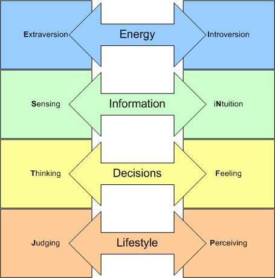

```{r setup1, include=FALSE}
library(data.table)
library(dplyr)
library(ggplot2)
library(ggthemes)
library(knitr)
library(reshape2)
opts_chunk$set(echo=FALSE, message=FALSE, warning = FALSE)
```

# Introduction

Team members for the experimental study are Minhchau Dang, Sue Yang, and Chuck Bolin. The project could not have been completed in its current state without the help of research assistants Carter Lin and Grace Bolin.

## Motivation

Students at all levels ranging from high school to advanced PhD studies are required to read a variety of documents ranging from literature, news articles, published papers, and academic texts. These requirements are stipulated throughout a course of study in the form of assignments.

Reading assignments issued by the teacher will include the name of the document along with a number of pages to read. In many cases the student is tasked with completing the reading with very little guidance, if any.

Imagine one is assigned to read a 30 page technical document describing Google File System followed by the instruction, "Be prepared to discuss in class."

This assignment presents a quandary to the student. What should the student take away from the reading? Is a high-level understanding of the file system sufficient, or does the teacher care about the functional level of connecting several computers? Should the student memorize countless details or gloss over them? The expectation is finally clarified when the class meets to actually discuss the reading. If the students failed to read the teacher's mind then this may feed a negative view of the student, or the student may feel that the preparation time was wasted.

Details are important! Or perhaps they are not? It depends upon the people involved in the agreement to read and discuss the text.

## Personality

Personality means the combination of characteristics or qualities that form an individual's distinctive character. It is believed to be formulated by the time a child enters first grade [@livescience2010]. A long established method of describing personality is through the use of the Myers-Briggs Type Indicator (MBTI) instrument [@mbtiWikipedia]. The test instrument uses 93 forced-choice questions to express a personality into four MBTI dichotomies [@mbtiDichotomies].



Upon completing the test, each individual is given a report describing their personality type [@mbtiEnglishTest]. A personality type is expressed as a four character combination [@mbtiRatio], such as ENFP, INFP, and INTP, with each character indicating your preference in each of the four MBTI dichotomies.

The focus of this research paper is on the Sensing-Intuition dichotomy. This dichotomy indicates whether a person is high or low detailed when approaching information [@mbtiSvsN], and the two sides are described as follows:

* **Sensing (high-detail)**: "I notice facts and I remember details that are important to me."
* **Intuition (low-detail)**: "I remember events more as an impression of what it was like than as actual facts or details of what happened."

When aggregating by dichotomy, 26.9% of the population are Intuition (low-detail), while Sensing (high-detail) commands a largely disproportionate value of 73.1%. This is significant when comparing the proportions of the other three attributes which tend to have a more balanced ratio.

```{r population_percentage, fig.height=3, fig.width=8}
# Create a data table from the original data

ratios <- data.table(
  t(data.frame(
    ISTJ = 0.116, ISFJ = 0.138, INFJ = 0.015, INTJ = 0.021,
    ISTP = 0.054, ISFP = 0.088, INFP = 0.044, INTP = 0.033,
    ESTP = 0.043, ESFP = 0.085, ENFP = 0.081, ENTP = 0.032,
    ESTJ = 0.087, ESFJ = 0.123, ENFJ = 0.025, ENTJ = 0.018
  )),
  keep.rownames = TRUE
)

names(ratios) <- c('personality', 'proportion')
ratios[, proportion := as.numeric(proportion)]

# Separate the personality strings into personality groups

tagged.ratios <- ratios[,
  .(
    personality = personality,
    proportion = proportion,
    energy = substr(personality, 1, 1),
    information = substr(personality, 2, 2),
    decisions = substr(personality, 3, 3),
    lifestyle = substr(personality, 4, 4)
  )
]

melted.ratios <- melt(
  data.frame(tagged.ratios),
  id.vars = c('personality', 'proportion'))

# Compute and plot the aggregate ratios

aggregate.ratios <- melted.ratios %>%
  group_by(variable, value) %>% summarise(proportion = sum(proportion))

ggplot(aggregate.ratios, aes(value, proportion)) +
  geom_bar(stat = 'identity', position = 'dodge') +
  facet_wrap(~ variable, scales = 'free_x', ncol = 6) +
  theme_bw() + theme(axis.title.x=element_blank())
```

## Research Questions

Do unguided reading assignments risk discriminating against 26.9% of the population--the Intuition (low-detail) people?

In order to answer this larger question, the team breaks it down into three primary sub-questions.

1. Are the Sensing (high-detail) and Intuitive (low-detail) populations different from each other in a reading recall task?
2. Is there a treatment effect through the use of guidance for the reading?
3. Is this effect different between Sensing (high-detail) and Intuitive (low-detail) personalities?

You cannot change someone from being a Sensing (high-detail) personality type into being an Intuitive (low-detail) personality type through an experiment. If you simply attempt to observe the differences, there are countless confounding variables that could explain any apparent differences between the two populations studied. This makes the first question a fundamentally unanswerable question for experimental research.

In operationalizing the remaining two sub-questions, the team designed an experiment that will explicitly look at the following two questions:

1. Does a study guide accompanying the reading assignment improve reading recall for both personality types?
2. Is the improvement in recall from the study guide different between the two personality types?

The primary goal of this operationalization will be to answer the second question. More explicitly, is there a heterogeneous treatment effect from a study guide accompanying the reading assignment?

## Hypothesis

The team hypothesizes that under experimental conditions evaluating memory recall of information from a reading assignment, Sensing (high-detail) subjects would score higher than Intuition (low-detail) subjects in the control group (without guidance).

When provided with guidance (the treatment), it is hypothesized that both groups will score higher than their counterparts in the control group. Furthermore, it is proposed that Intuition (low-detail) personality will improve more than Sensing (high-detail) personality, thus reducing the gap between the two personality types.