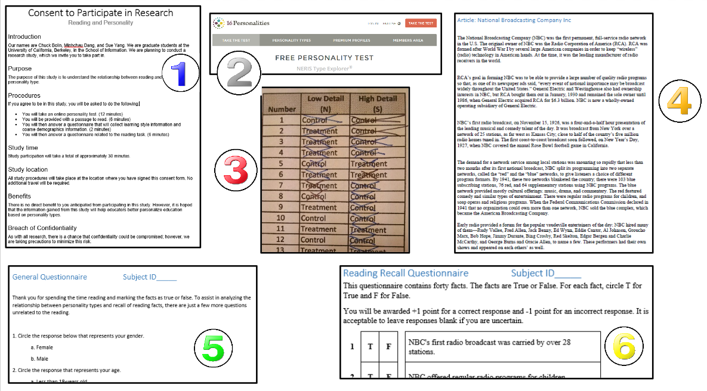

```{r setup2, include=FALSE}
library(knitr)
opts_chunk$set(echo=FALSE, message=FALSE, warning = FALSE)
```

# Experimental Design

## Definition of Treatment

The key difficulty for a person tasked with a reading assignment is the uncertainty of knowing the parts of the reading upon which to focus. Therefore the treatment is presented in the form of a primer.

In the primer provided to the control group, the participants would be given the following paragraph *without guidance*.

> You will be given 6 minutes to read an article. Be prepared to answer some questions.
>
> ***Thank you for your participation in this experiment. Please do not share details of the experiment with others as it may compromise the usefulness of the final results.***

In the primer provided to the treatment group, the participants would be given the following paragraph *with guidance*.

> You will be given 6 minutes to read an article. Be prepared to answer some questions.
>
> ***You do NOT need to know facts related to dates (years, months, or days) referenced in the article. You do NOT need to know the names of any entertainers.***

These sentences are written in order to minimize any potential effect due to awareness of being in a treatment or control group in a group session setting, in the event that a participant glances at another participant's primer.

## Experimental Sequence

The following sequence of events describes the experiment. All forms and documents used in this sequence of events are available as supplementary material accompanying this report. It is applicable to administration to individuals or to groups of subjects.

0. Subjects arrive and are welcomed. Subjects are reminded not to discuss details of the experiment for four weeks.
1. Subjects read the "Consent to Participate in Research" form, ask any relevant questions, and sign the document.
2. Subjects complete the online "Personality Test". The subjects are assigned a unique ID number and their personality types (e.g. INTJ-A) are recorded.
3. The researcher references a pre-generated block randomization based upon the Sensing (high-detail) or Intuition (low-detail) personality type results and assigns each subject to a control or treatment group.
4. Subjects are provided either a control or treatment primer (based on their group assignment) and are directed to read it. Subjects are provided an “Article” and given six minutes to read it.
5. Subjects are given a "Covariate Questionnaire". In addition to providing basic information the questionnaire serves as a purposeful disruption in the cognitive process of memory recall before being queried on the reading assignment.
6. Subjects are given a 40 question "Reading Recall Questionnaire", informed of the scoring rules (gain 1 point for a correct response, lose 1 point for an incorrect response, and 0 points if they chose not to answer), and allotted six minutes to complete the task.
7. Subjects are thanked and reminded not to discuss details of the experiment for four weeks. If conducted on paper, the researcher enters the results of the personality tests and both questionnaires into an online form connected to Google Sheets.

The procedure for the steps described above are diagrammed below.



## Reading Considerations

The first task is to identify an appropriate reading for the experimental subjects. When evaluating potential reading materials, the following factors are deemed relevant:

* **Reading Level**:  Materials are to be chosen at reading level that contains a significant number of details without being too esoteric. Using the Flesch-Kincaid Reading Ease algorithm [@fleschKincaid], an article that scored grade 12.8 was selected.
* **Neutral content**: The material does not include information that may alienate the subject. Therefore, topics such as religion and politics were excluded. To quote one subject’s concern about the reading assignment prior to the experiment, "It's not about witchcraft or the devil, is it?"
* **Length**: The length of the reading is an important factor. If it is too long,  the subject may grow weary. If it is too short, the subjects’ personality resistance to the number of details may be insufficiently exercised. A word count of approximately 700 words in a six-minute period is sufficient when considering the average reading speed for adults. [@readingSpeed].

An excerpt from an article from an encyclopedia entry on the National Broadcasting Company, Inc. [@nbcReading] was chosen for the experiment. This article is available in the supplementary material accompanying this report.

## Other Considerations

The team agreed upon the description of the experiment as a "Personality vs. Reading" study. This language was to be used in email, telephone, and in-person requests for volunteers. Disclosure of details such as specifying high and low detail personality types was avoided, including the word "recall" in order to not cue participants to memorize details.

When examining the parameters of experimentation, whether it should be conducted online or in-person only, the researchers were cognizant that an online participant's study style might compel them to refer back to a locally saved copy of the text if taken on-line. This aspect could affect proper randomization, such as an uneven distribution of these individuals between treatment and control or between Sensing (high-detail) and Intuition (low-detail) personalities. Therefore, it was decided to conduct the experiment in-person only.

When conducting in-person experiments, the team determined whether subjects should be tested one at a time in order to ensure consistency across subjects, or if the team should allow for larger groups for efficiency. A single subject could be tested at a cost of approximately 35 minutes, or a large group of subjects could be tested at a cost of about one hour. The team opted to allow for group testing, and to treat a single subject as an extra small group.

The method of assessment was another concern. The team discussed multiple choice and true/false type of questions. It was agreed that a true/false questionnaire would accommodate single and group testing scenarios, and it would greatly simplify analysis as it would exclude  variation as to which wrong answer was preferred.

During the experiment, questions from the subject were taken prior to signing the "Consent to Participate in Research". After this point, we limited our speech to administrative directions. This would allow us to minimize any potential differences between researchers with respect to their interactions with the subjects.

## Design Description

The experiment is described with the following table using the notation suggested by the Web Center for Social Research Methods [@designNotation]:

\newpage

| Region             | Personality Test | Sensing vs Intuitive | Assignment      | Treated | Collect Test Score |
|--------------------|------------------|----------------------|-----------------|---------|--------------------|
| N (South Carolina) | O                | N (Sensing)          | R (Block S1-T)  | X       | O                  |
|                    | O                |                      | R (Block S1-C)  |         | O                  |
|                    | O                | N (Intuitive)        | R (Block N1-T)  | X       | O                  |
|                    | O                |                      | R (Block N1-C)  |         | O                  |
| N (California)     | O                | N (Sensing)          | R (Block S2-T)  | X       | O                  |
|                    | O                |                      | R (Block S2-C)  |         | O                  |
|                    | O                | N (Intuitive)        | R (Block N2-T)  | X       | O                  |
|                    | O                |                      | R (Block N2-C)  |         | O                  |
| N (Delaware)       | O                | N (Sensing)          | R (Block S3-T)  | X       | O                  |
|                    | O                |                      | R (Block S3-C)  |         | O                  |
|                    | O                | N (Intuitive)        | R (Block N3-T)  | X       | O                  |
|                    | O                |                      | R (Block N3-C)  |         | O                  |

The nonrandom and random groups are identified as follows:

* The location of the subject (South Carolina, California, Delaware) is not a random variable manipulated by the researchers.
* The personality test result is not a random variable manipulated by the researchers.
* The subject is assigned to either control or treatment using pre-generated randomized lists (block randomization) that were created for each personality type at each location. This is a random variable manipulated by the researchers.

This notation makes explicit the fact that our team's experimental design is effectively six smaller experiments.